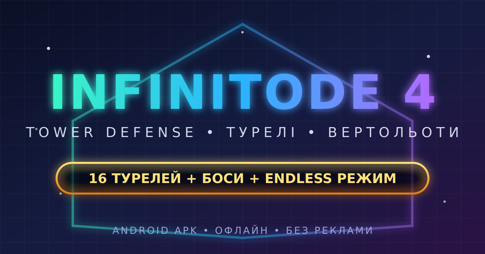

# 🚁 INFINITODE 4 — Tower Defense

[](https://github.com/vladskod31-alt/Infinitode-2/actions/workflows/build-apk.yml)
[](https://github.com/vladskod31-alt/Infinitode-2/releases)
[](https://github.com/vladskod31-alt/Infinitode-2/releases)
[](https://github.com/vladskod31-alt/Infinitode-2)
[](LICENSE)

Нова **tower defense** в дусі легендарної **Infinitode 2**: **16 видів турелей**, бойові **вертольоти**, епічні **боси**, 3 мапи і безкінечний режим. Класний SVG-інтерфейс, профіль командира, дослідження, досягнення. **Повністю офлайн, без реклами**, важить лише **~8 МБ**.

> 🇬🇧 A brand-new tower defense in the spirit of Infinitode 2: 16 turret types, attack helicopters, epic bosses, 3 maps and endless mode. Classy SVG UI, commander profile, research, achievements. **Fully offline, no ads**, only **~8 MB**.

## 📥 Завантажити APK / Download

👉 **[Остання версія — Releases](../../releases)** → `Infinitode4-vX.Y.Z-release.apk`

1. Завантаж APK на телефон / Download the APK.
2. Дозволь встановлення з невідомих джерел / Allow unknown sources.
3. Грай! Android 7.0+ / Enjoy! Android 7.0+.

Також можна грати прямо в браузері: відкрий `game/index.html` (або запусти `python3 -m http.server` в папці `game/`).

## 🗼 16 турелей + бонуси

| # | Турель | Особливість |
|---|--------|-------------|
| 1 | **Базова** | Дешева і надійна, рикошети |
| 2 | **Гармата** | Вибухові снаряди, шрапнель |
| 3 | **Дробовик** | Віяло снарядів по натовпу |
| 4 | **Снайпер** | Величезна дальність, крит-хедшоти |
| 5 | **Морозилка** | Сповільнення + вразливість, синергія з отрутою/теслою |
| 6 | **ППО** | Шредер повітряних цілей, підпал |
| 7 | **Шрапнель** | Кільцевий залп на всі боки |
| 8 | **Вибух** | Нова з оглушенням і відкиданням |
| 9 | **Мініган** | Розкрутка до шаленого темпу |
| 10 | **Отрута** | Доти, стаки, сповільнення швидких |
| 11 | **Тесла** | Ланцюгова блискавка |
| 12 | **Ракети** | Самонаведення + глобальні LRM-удари |
| 13 | **Вогнемет** | Конус вогню + підпал |
| 14 | **Лазер** | Заряд і прошиваючий промінь |
| 15 | **Гаус** | Рейковий постріл крізь стрій |
| 16 | **Дробарка** | Хапає і перемелює ворогів |
| 🚁 | **Ангара** *(бонус)* | Бойові вертольоти-дрони |
| ⛏ | **Майнер** *(бонус)* | Видобуває монети |

Кожна вежа качається до **10 рівня**, на 4/7 — вибір здібності з двох, на 10 — **ульта**. 6 режимів прицілювання (перший/останній/сильний/слабкий/швидкий/близький).

## 🎮 Фічі

- 🚁 **Удар з неба** — виклик бойового вертольота підтримки
- 🗺 **3 мапи**: Зелена долина • Піщаний вир • Арктична ніч
- 🌊 **30 хвиль + endless**, боси кожні 10 хвиль
- 👾 **12 типів ворогів**: звичайні, швидкі, броня, лікарі, токсики, крижані, винищувачі, світляки, **вертоліти**, джети, боси
- 🔬 Дерево досліджень (8 гілок), 👤 профіль з 8 аватарами і званнями, 🏆 16 досягнень
- 🎨 Неоновий **SVG UI**, 🇺🇦/🇬🇧 мови, швидкість x1/x2/x3, авто-хвилі
- 🎵 Справжній саундтрек: **Kevin MacLeod** (CC-BY 4.0) — Heroic Age, Volatile Reaction, Interloper, Unholy Knight + синтезовані SFX
- 📴 0 дозволів, сейви локально, без трекінгу

## 🛠 Розробка / Development

```
game/            HTML5 гра (Canvas + SVG UI, без залежностей)
  js/            balance • engine • render • ui • audio • storage
  assets/        іконки, фони, музика (генеруються в tools/)
android/         Gradle-обгортка (WebView, офлайн)
tools/           генератори асетьів + тести (node)
.github/         CI: тести → підписані APK → Release
```

```bash
# тести
cd tools && npm install && npm test

# перегенерувати асети (іконки/фони/музика)
node tools/gen-assets.mjs && node tools/gen-music.mjs

# грати локально
python3 -m http.server 8080 --directory game
```

APK збирається автоматично в **GitHub Actions** при кожному пуші і публікується в [Releases](../../releases). Підписаний стабільним demo-ключем (`android/infinitode4-release.p12`), тож оновлення ставляться поверх. Для публікації в Google Play згенеруй власний ключ і не комміть його.

## 📄 Ліцензія

[MIT](LICENSE) © 2026 vladskod31-alt. Натхненно грою [Infinitode 2](https://infinitode-2.fandom.com/) (Prineside) — фанатський некомерційний проєкт, всі асети оригінальні.
